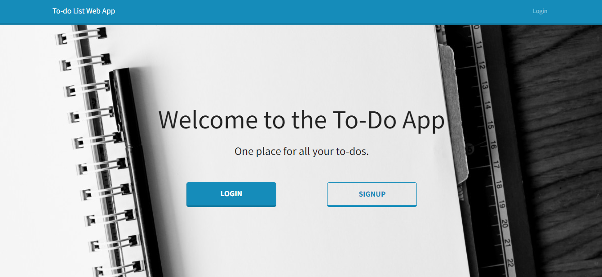
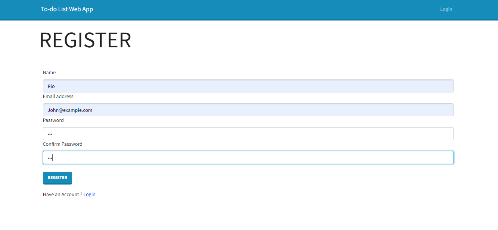
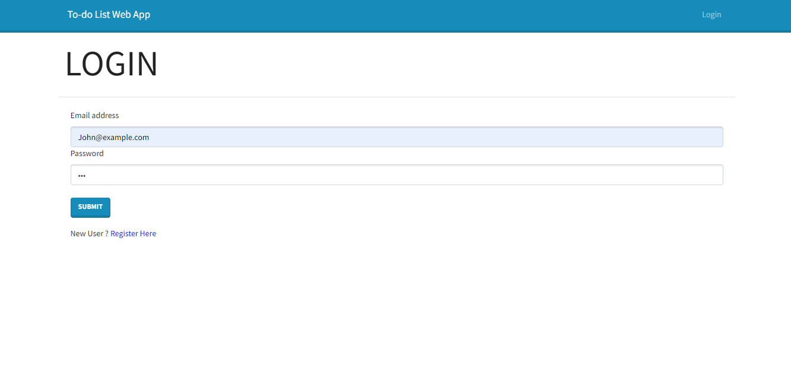
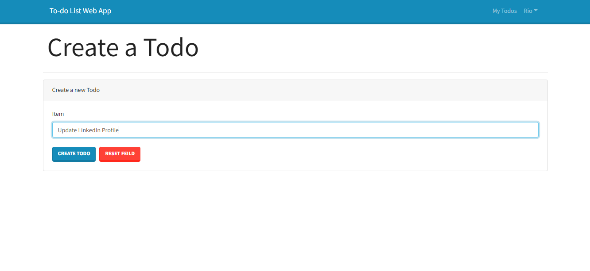

# MERN-Todo-With-Auth

> This is a Full-stack MERN application with JWT Authentication

## Table of Contents:

- [General Info](#general-information)
- [Installation](#installation)
- [Usage Instructions](#usage-instructions)
- [Screenshots](#screenshots)
- [Credits](#credits)
- [Contact](#contact)

## General Information

This is a Full-stack MERN app using MongoDB, Express, React & Node.js. I have alos utilised Redux in order to manage the state of my application.

## Installation

To run this project, do the following:

1. npm install
2. npm start
3. Open a new terminal
4. cd frontend
5. npm install
6. npm start
7. The frontend will automatically open the application in the browser. The backend/server runs on http://localhost:8080/ and the frontend on http://localhost:3000

## Usage Instructions

In order to have access to the Todo App, exisiting users will be required to login by entering their username (email) and password. New users will need to register prior to utilising the app.

Each users’ to-do list is saved to a database. When a user logs in
they will only be able to see and modify their own to-do list. It is important to note that the user’s to-do list is preserved between sessions.

## Screenshots
**Welcome Screen**

**Registration Screen**

**Login Screen**

**Creating a Todo**

## Credits

- The MERN Stack Project [tutorial](https://www.youtube.com/playlist?list=PLKhlp2qtUcSYC7EffnHzD-Ws2xG-j3aYo) with Redux 2021 - by RoadsideCoder.
- HyperionDev - https://www.hyperiondev.com/

## Contact

👤 **Riaz Karolia**

Feel free to contact me on [LinkedIn](https://www.linkedin.com/in/riaz-karolia/)
